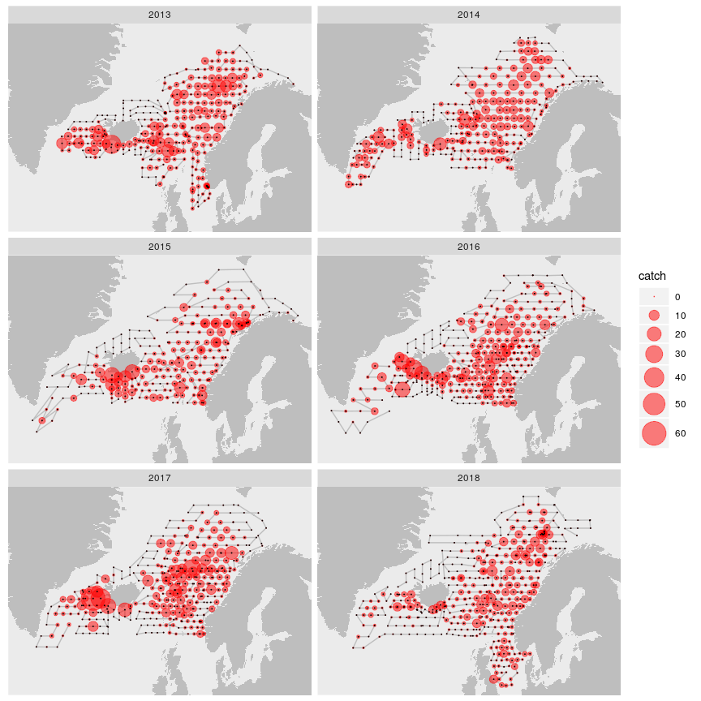

### Shaking hands with PGNAPES
#### Einar Hjörleifsson
#### 2019-08-16


```r
library(tidyverse)
library(pgnapes)
library(maps)
library(mapdata)
```

**Connect to database**:


```r
con <- pgn_connect("your_user_name", "your_password")
```


**Available wrappers**:


```r
pgn_acoustic(con)
pgn_acousticvalues(con)
pgn_biology(con)
pgn_catch(con)
pgn_countries(con)
pgn_hydrography(con)
pgn_icessquares(con)
pgn_icessquares_big(con)
pgn_igoss(con)
pgn_plankton(con)
pgn_logbook(con)
pgn_species(con)
pgn_stationtypes(con)
pgn_survey(con)
pgn_vessels(con)
```

**Get and "standardize" mackerel catch**:


```r
d <-
  pgn_logbook(con) %>%
  filter(year %in% 2013:2018,
         month %in% 7:8) %>%
  arrange(cruise, year, month, day, hour, min) %>% 
  left_join(pgn_catch(con)) %>%
  collect(n = Inf) %>%
  mutate(catch = catch / 1000 / (towtime / 60)) %>%
  filter(species %in% "MAC") %>% 
  collect(n = Inf)
st <-
  d %>% 
  select(cruise, year, lon, lat) %>% 
  distinct()
```

**Map catch**:


```r
xlim <- range(st$lon)
ylim <- range(st$lat)
m <- map_data("worldHires", xlim = xlim, ylim = ylim)

d %>% 
  ggplot(aes(lon, lat)) +
  geom_polygon(data = m, aes(long, lat, group = group), fill = "grey") +
  geom_path(data = st, aes(group = cruise), colour = "grey") +
  geom_point(aes(size = catch), colour = "red", alpha = 0.5) +
  scale_size_area(max_size = 10) +
  geom_point(data = st, size = 0.01) +
  geom_path(data = geo::island) +
  facet_wrap(~ year, ncol = 2) +
  coord_quickmap(xlim = xlim, ylim = ylim) +
  scale_x_continuous(NULL, NULL) +
  scale_y_continuous(NULL, NULL)
```

<!-- -->

