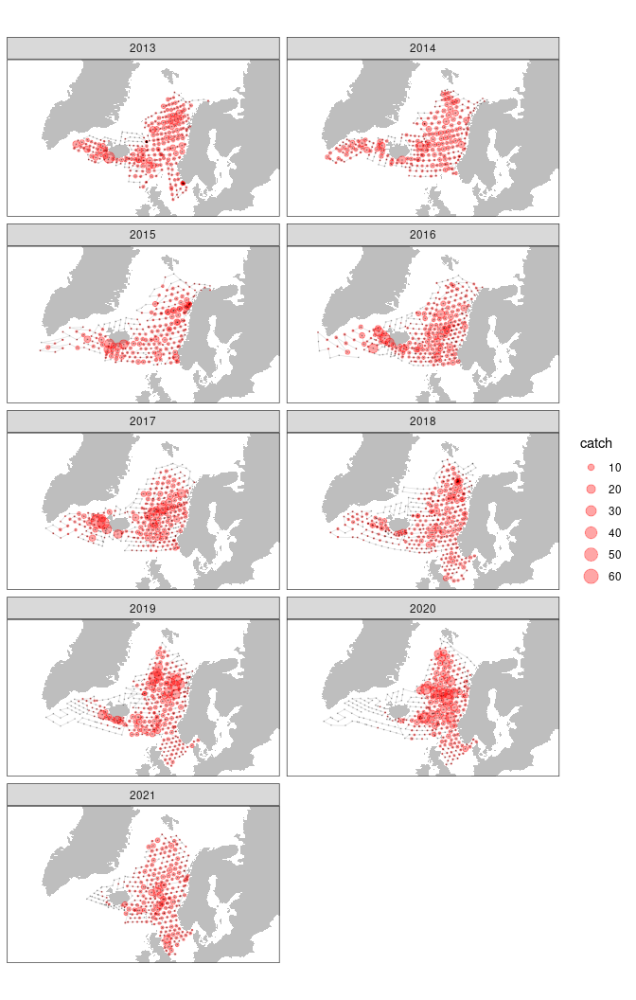

<!-- README.md is generated from README.Rmd. Please edit that file -->

# pgnapes

<!-- badges: start -->
<!-- badges: end -->

The goal of {pgnapes} is to:

-   Establish R-connection to PGNAPES Oracle database
-   Provide convenient functions to PGNAPES tables and views
-   R-code examples for data analysis and graphical presentations

## Installation

You can install the development version of pgnapes from
[GitHub](https://github.com/) with:

``` r
install.packages("devtools")
remotes::install_github("einarhjorleifsson/pgnapes")
```

The backbone of {pgnapes} is {dplyr} which allows for generation of
simple or complex sequence of codes that are automatically translated to
SQL via the {dbplyr}-package. Since the PGNAPES database is Oracle 11g
one can not use {dbplyr} versions \>2.0. Hence we need to install an
older version:

``` r
remotes::install_github("tidyverse/dbplyr@v1.4.4", force = TRUE)
```

**Side effects**: Installing an earlier version of {dbplyr} means that
one can not load the {tidyverse} package only its child packages (dplyr,
ggplot2, tidyr, tibble, ….). Reinstalling the latest version of {dbplyr}
is done by `install.packages("dbplyr")`.

## Connection

All functions in the {pgnapes} package have a prefix `pgn_`. The core
function in {pgnapes} is the `pgn_connect` that provides a connection to
the PGNAPES database. The arguments of the function are *username*,
*password* and *use_odbc*. The two first arguments are self-expanatory.
The arguement *use_odbc* (default TRUE) provides a control if connection
is made via {odbc} or {ROracle}. The latter is generally faster but the
{ROracle}-package setup is more difficult (see furhter notes below)

**At the start of an R-sesssion load some packages**:

``` r
library(dplyr)
library(tidyr)
library(ggplot2)
library(maps)
library(pgnapes)
```

**Connect to the database**:

The first thing to do is to establish a connection to the
PGNAPES-database by:

``` r
con <- pgn_connect(username = "your_user_name", password = "your_password")
```

You should now get something like the following:

``` r
con
#> <OdbcConnection> ICE@oracle.hav.fo/xe
#>   Oracle Version: 11.02.0020
```

## The PGNAPES tables

The functions below are a convenient wrapper to access all the tables in
pgnapes:

``` r
pgn_acoustic(con)
pgn_acousticvalues(con)
pgn_biology(con)
pgn_catch(con)
pgn_countries(con)
pgn_hydrography(con)
pgn_icessquares(con)
pgn_icessquares_big(con)
pgn_igoss(con)
pgn_plankton(con)
pgn_logbook(con)
pgn_species(con)
pgn_stationtypes(con)
pgn_survey(con)
pgn_vessels(con)
```

## Examples

### Get and “standardize” mackerel catch

``` r
d <-
  pgn_logbook(con) %>%
  filter(year >= 2013,
         month %in% 7:8,
         sttype %in% c("PTRAWL", "TRAWL", "Multpelt", "PTrawl_Straight",
                       "DeepTrawl", "Multpelt 832")) %>%
  arrange(cruise, year, month, day, hour, min) %>%
  left_join(pgn_catch(con) %>% 
              filter(species %in% "MAC")) %>%
  collect(n = Inf) %>% 
  mutate(catch = catch / 1000 / (towtime / 60),
         catch = replace_na(catch, 0))
glimpse(d)
#> Rows: 2,959
#> Columns: 22
#> $ country    <chr> "FO", "FO", "FO", "FO", "FO", "FO", "FO", "FO", "FO", "FO",…
#> $ vessel     <chr> "XPXP", "XPXP", "XPXP", "XPXP", "XPXP", "XPXP", "XPXP", "XP…
#> $ cruise     <chr> "1352", "1352", "1352", "1352", "1352", "1352", "1352", "13…
#> $ station    <chr> "13520001", "13520003", "13520005", "13520007", "13520009",…
#> $ sttype     <chr> "TRAWL", "TRAWL", "TRAWL", "TRAWL", "TRAWL", "TRAWL", "TRAW…
#> $ year       <dbl> 2013, 2013, 2013, 2013, 2013, 2013, 2013, 2013, 2013, 2013,…
#> $ log        <chr> NA, NA, NA, NA, NA, NA, NA, NA, NA, NA, NA, NA, NA, NA, NA,…
#> $ month      <dbl> 7, 7, 7, 7, 7, 7, 7, 7, 7, 7, 7, 7, 7, 7, 7, 7, 7, 7, 7, 7,…
#> $ day        <dbl> 3, 3, 3, 4, 4, 4, 5, 5, 5, 6, 6, 6, 6, 7, 7, 8, 8, 8, 8, 9,…
#> $ hour       <dbl> 6, 14, 22, 5, 14, 22, 4, 12, 17, 0, 8, 15, 20, 7, 17, 1, 8,…
#> $ min        <dbl> 58, 4, 22, 55, 42, 2, 49, 46, 39, 53, 14, 0, 59, 16, 46, 14…
#> $ lat        <dbl> 60.96722, 60.58263, 60.58520, 60.58342, 59.46975, 59.44432,…
#> $ lon        <dbl> -6.85520, -8.78505, -10.70880, -12.91440, -12.95920, -11.14…
#> $ bottdepth  <chr> "186", "243", "276", "700", "1200", "1650", "1400", "570", …
#> $ windir     <chr> "45", "0", "270", "180", "225", "225", "225", "225", "225",…
#> $ winspeed   <chr> "8", "0", "10", "10", "15", "20", "8", "12", "12", "18", "1…
#> $ species    <chr> "MAC", "MAC", "MAC", "MAC", "MAC", "MAC", "MAC", "MAC", "MA…
#> $ catch      <dbl> 0.050300, 0.900000, 2.668100, 0.228040, 0.000000, 0.000000,…
#> $ towtime    <dbl> 30, 30, 30, 30, 30, 30, 30, 30, 30, 30, 30, 30, 30, 30, 30,…
#> $ wirelength <chr> "350", "350", "360", "350", "350", "350", "350", "350", "12…
#> $ towspeed   <chr> "4.9", "5", "5.1", "5.3", "4.5", "4.7", "4.9", "4.8", "4.3"…
#> $ trawldepth <chr> "0", "0", "0", "0", "0", "0", "0", "0", "100", "0", "0", "0…
```

**Map catch**:

``` r
xlim <- range(d$lon)
ylim <- range(d$lat)
m <- map_data("world", xlim = xlim, ylim = ylim)
d %>% 
  ggplot(aes(lon, lat)) +
  theme_bw() +
  geom_polygon(data = m, aes(long, lat, group = group), fill = "grey") +
  geom_path(aes(group = cruise), colour = "grey", lwd = 0.25, alpha = 0.5) +
  geom_point(data = d %>% filter(catch > 0),
             aes(size = catch), colour = "red", alpha = 0.35) +
  scale_size_area(max_size = 5) +
  geom_point(size = 0.01, alpha = 0.2) +
  facet_wrap(~ year, ncol = 2) +
  #coord_quickmap(xlim = xlim, ylim = ylim) +
  coord_map(projection = "azequalarea",
            xlim = xlim, ylim = ylim) +
  scale_x_continuous(NULL, NULL) +
  scale_y_continuous(NULL, NULL)
```



## Intalling ROracle

Your IT-department may be of help here, details on intallments are
[here](http://cran.hafro.is/web/packages/ROracle/INSTALL). Information
on the installation of the needed Oracle Instant Client are
[here](https://www.oracle.com/database/technologies/instant-client.html).
